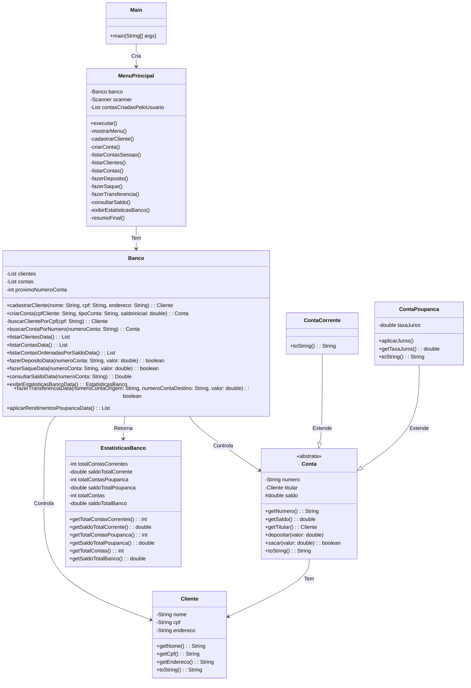

# Projeto 1 da disciplina DIM0501 - Boas práticas de porgramação

## 1. Sobre o Projeto

Este projeto consiste em um Sistema Bancário, desenvolvido em Java, com o objetivo de aplicar e demonstrar as boas práticas de programação aprendidas em sala de aula.

O sistema simula operações bancárias básicas, incluindo cadastro de clientes, criação de contas (corrente e poupança), depósitos, saques, transferências e geração de relatórios.

---

## 2. Funcionalidades Implementadas

O sistema implementa as seguintes funcionalidades obrigatórias:

* **Gerenciamento de Clientes:**
    * Cadastro de novos clientes (Nome, CPF) com verificação de duplicidade.

* **Gerenciamento de Contas:**
    * Criação de contas (Corrente ou Poupança) vinculadas a um cliente, com número único e saldo inicial.

* **Operações Financeiras:**
    * **Depósito:** Adiciona valor ao saldo.
    * **Saque:** Subtrai valor do saldo (com verificação de fundos).
    * **Transferência:** Move valores entre duas contas.

* **Recursos Específicos:**
    * **Aplicação de Rendimento:** Aplica um percentual de rendimento a todas as contas do tipo Poupança.

* **Consultas e Relatórios:**
    * Consulta de saldo individual.
    * Listagem de todas as contas em ordem descendente de saldo.

---

## 3. Boas Práticas e Padrões Aplicados

Este projeto foi estruturado com foco nos seguintes conceitos de boas práticas:

* **SOLID:**
    * **SRP (Princípio da Responsabilidade Única):** Descreva como as classes (ex: `Cliente`, `Conta`, `Banco`) foram separadas com responsabilidades únicas.

    * **OCP (Princípio Aberto/Fechado):** Explique como o uso de classes abstratas (`Conta`) e herança (`ContaCorrente`, `ContaPoupanca`) permite extensão sem modificação.

* **Clean Code:**
    * Mencione a preocupação com nomes de variáveis e métodos significativos, métodos curtos e coesos, e o uso de comentários apenas quando estritamente necessário.

* **Encapsulamento:**
    * Explique como os atributos das classes (especialmente `saldo`) são protegidos e acessados apenas por métodos públicos (ex: `depositar()`, `sacar()`).

* **Tratamento de Exceções:**
    * (Se aplicável) Descreva como o sistema lida com situações de erro, como saques com saldo insuficiente ou cadastro de CPFs duplicados.

---

## 4. Tecnologias Utilizadas

* **Linguagem:** Java 
* **IDE:** VS Code
* **Controle de Versão:** GitHub

---

## 5. Como Compilar e Executar o Sistema

Estas são as instruções para compilação e execução do projeto via terminal.

### Pré-requisitos

* Java Development Kit (JDK) 11 ou superior.
* Git (para clonar o repositório).

### Passos

### 5.1.  **Clonar o repositório:**
    ```bash
    git clone https://github.com/Leonewton/pelado-banco/
    cd pelado-banco
    ```

### 5.2.  **Compilar o sistema:**
DO TO
### 5.3.  **Executar o sistema:**
DO TO
---

## 6. Diagrama de classes



---

## 7. Equipe (Autores)

Este projeto foi desenvolvido pelos seguintes integrantes:

* **JONATHAS LEONILTON DE LIMA SOUZA** - (Leonewton)
* **MARCELO DOS SANTOS VIEIRA** - (marcelo0404)
* **JOÃO MARCOS SILVA FERNANDES DE FREITAS** - (jomasii) 